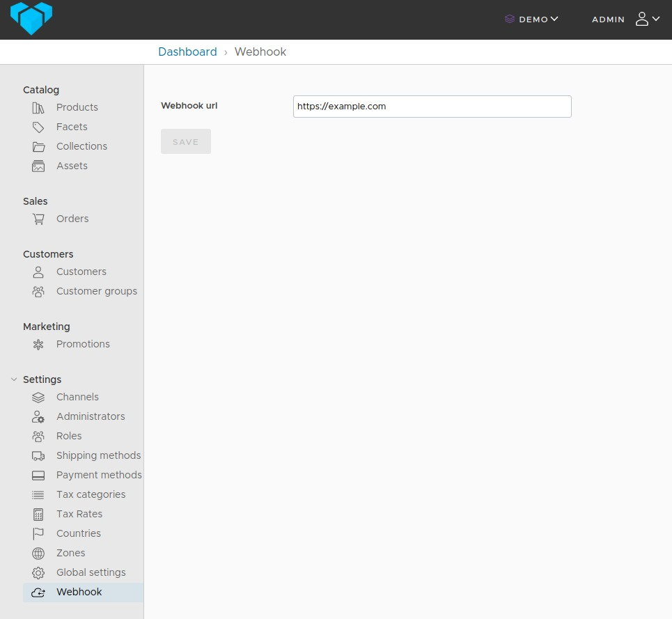

# Vendure Webhook plugin

Triggers a channel aware webhook based on configured events.
Events are specified in `vendure-config` and webhooks are configured in the database via the admin UI.

1. `yarn add vendure-plugin-webhook`

## Database entity

The plugin adds an entity `WebhookPerChannelEntity` to your database.
Don't forget to run a migration OR `synchronize: true` if you like living on the edge.

## vendure-config.ts

Configure which events should trigger a webhook call in `vendure-config.ts`. HttpMethod can be POST (empty body) or GET.

```js
import { WebhookPlugin } from 'vendure-plugin-webhook';

plugins: [
  WebhookPlugin.init({
    httpMethod: 'POST',
    delay: 3000, // Optional if you want to wait for more events
    events: [ProductEvent, ProductVariantChannelEvent, ProductVariantEvent],
  }),
];
```

The `delay` is optional. Some actions/updates trigger mutliple events, resulting in multiple calls to your webhook.
If you want to prevent this, you can set the `delay`, the plugin will then wait X seconds for more events,
before calling your webhook.

## Compile admin UI

Run this script once to compile the admin UI. **Run with ts-node** to compile the admin UI:

```js
import { compileUiExtensions } from '@vendure/ui-devkit/compiler';
import * as path from 'path';
import { webhookAdminUi } from 'vendure-plugin-webhook';

compileUiExtensions({
  outputPath: path.join(__dirname, '__admin-ui'),
  extensions: [webhookAdminUi],
})
  .compile?.()
  .then(() => {
    process.exit(0);
  });
```

Then, in your `vendure-config.ts` add

```js
        AdminUiPlugin.init({
            port: 3002,
            app: {
                path: path.join(__dirname, '__admin-ui/dist')
            },
        }),
```

This will add a formfield for updating the webhook for the current channel under `Settings`:"  
  
For more information about using pre-compiled admin UI in production: https://www.vendure.io/docs/plugins/extending-the-admin-ui/

[](https://pinelab.studio)
